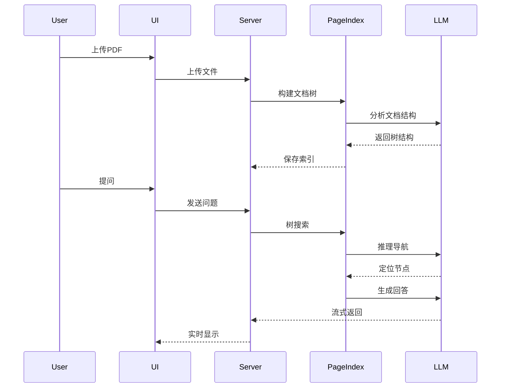

# PageIndex Chat UI

<p align="center">
  <strong>无向量 RAG 解决方案 | 推理式文档检索与智能问答</strong>
</p>

<p align="center">
  <a href="#特性">特性</a> •
  <a href="#快速开始">快速开始</a> •
  <a href="#使用指南">使用指南</a> •
  <a href="#技术架构">技术架构</a> •
  <a href="#致谢">致谢</a>
</p>

---

## 简介

PageIndex Chat UI 是一个基于 [PageIndex](https://github.com/VectifyAI/PageIndex) 开源项目实现的文档问答系统，提供了友好的 Web 聊天界面。本项目采用**无向量 RAG** 技术，通过树状结构推理检索替代传统的向量相似度匹配，实现更精准的文档问答。

### 核心理念

> **相似度 ≠ 相关性**

传统 RAG 系统依赖向量相似度进行检索，但语义相似的片段未必是回答问题所需的上下文。PageIndex 采用类似 AlphaGo 的树搜索算法，让 LLM 像人类一样"思考"并导航文档结构，精准定位答案来源。

## 特性

### 📄 PDF 文档处理
- 支持上传 PDF 文档进行索引
- 自动构建文档树状结构
- 保留文档原始层级关系

### 🤖 双模式 RAG

| 模式 | 说明 | 适用场景 |
|------|------|----------|
| **文本模式** | 将页面定义为文本内容进行检索 | 扫描版PDF、文字为主的文档 |
| **多模态模式** | 将页面定义为图片，使用 VLM 进行检索 | 图表、公式丰富的文档 |

### 🎯 精准定位检索
- 支持定位到具体的检索节点
- 显示推理思考过程
- 提供页码级别的答案溯源

### 💬 智能对话体验
- 流式输出回答
- 多轮对话记忆
- 现代化聊天界面

## 快速开始

### 环境要求

- Python >= 3.11
- OpenAI API Key（或其他兼容的 LLM 服务）

### 安装依赖

```bash
# 使用 pip
pip install -r requirements.txt

# 或使用 uv（推荐）
uv sync
```

### 配置模型

在首次运行时，通过 Web 界面的设置面板配置：

1. **文本模型**：用于文本模式 RAG（如 `gpt-4o-mini`）
2. **多模态模型**：用于视觉模式 RAG（如 `gpt-4.1`、`gpt-4o`）

需要配置：
- API Key
- Base URL（支持自定义 API 端点）

### 启动服务

```bash
# 使用启动脚本
./start.sh

# 或直接运行
python app.py
```

服务默认运行在 `http://localhost:5001`

## 使用指南

### 1. 上传文档

- 点击左侧边栏的上传按钮
- 选择 PDF 文件上传
- 等待索引构建完成

### 2. 开始对话

- 选择已索引的文档
- 输入问题进行提问
- 系统会自动进行树搜索并给出答案

### 3. 查看检索过程

- 点击回答中的节点标签可查看定位信息
- 推理过程会实时显示在界面上

### 4. 切换模式

- 通过界面上方的模式切换按钮
- 在文本模式和多模态模式间切换

## 技术架构

```
┌─────────────────────────────────────────────────────────────┐
│                      Frontend (Web UI)                       │
│                 Bootstrap + Socket.IO Client                 │
└─────────────────────────────────────────────────────────────┘
                              │
                              ▼
┌─────────────────────────────────────────────────────────────┐
│                    Backend (Flask + SocketIO)                │
├─────────────────────────────────────────────────────────────┤
│  ┌─────────────┐  ┌─────────────┐  ┌─────────────────────┐  │
│  │   Routes    │  │  Services   │  │      Models         │  │
│  │  - api.py   │  │ - rag_svc   │  │ - document.py       │  │
│  │  - socket   │  │ - indexing  │  │ - document store    │  │
│  └─────────────┘  └─────────────┘  └─────────────────────┘  │
└─────────────────────────────────────────────────────────────┘
                              │
                              ▼
┌─────────────────────────────────────────────────────────────┐
│                    PageIndex Core                            │
│  - Tree Search Algorithm                                     │
│  - Node Mapping                                              │
│  - PDF Processing (PyMuPDF)                                  │
└─────────────────────────────────────────────────────────────┘
                              │
                              ▼
┌─────────────────────────────────────────────────────────────┐
│                    LLM Providers                             │
│              OpenAI API / Compatible Services                │
└─────────────────────────────────────────────────────────────┘
```

### 核心流程



## 项目结构

```
pageindex-chat-ui/
├── app.py                 # Flask 应用入口
├── config.py              # 配置管理
├── main.py                # 主程序
├── start.sh               # 启动脚本
├── requirements.txt       # 依赖列表
├── pyproject.toml         # 项目配置
├── pageindex/             # PageIndex 核心实现
│   ├── page_index.py      # 树搜索算法
│   ├── utils.py           # 工具函数
│   └── config.yaml        # PageIndex 配置
├── models/                # 数据模型
│   └── document.py        # 文档存储模型
├── routes/                # 路由处理
│   ├── api.py             # REST API
│   └── socket_handlers.py # WebSocket 处理
├── services/              # 业务服务
│   ├── rag_service.py     # RAG 服务
│   └── indexing_service.py# 索引服务
├── templates/             # 前端模板
│   └── index.html
├── static/                # 静态资源
│   └── js/app.js
├── uploads/               # 上传文件存储
└── results/               # 索引结果存储
```

## 致谢

本项目核心的 PageIndex 索引算法参考自 [VectifyAI/PageIndex](https://github.com/VectifyAI/PageIndex) 开源项目。


## License

MIT License

---

<p align="center">
  Made with ❤️ for better document understanding
</p>
